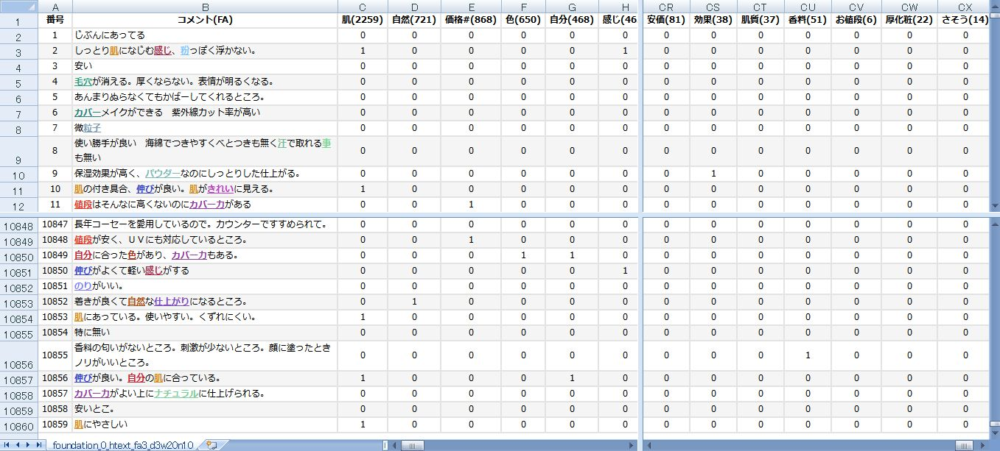
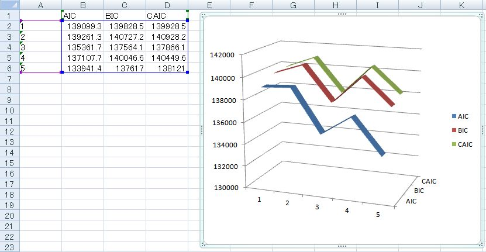
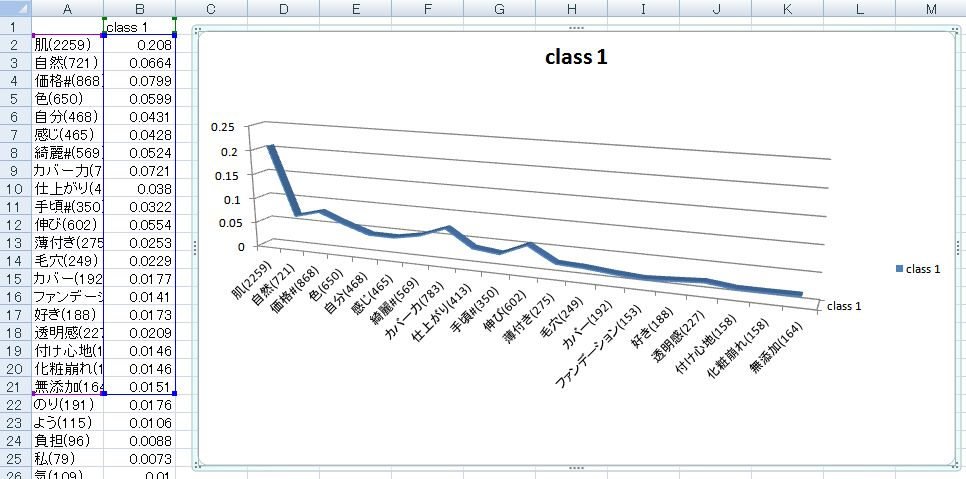
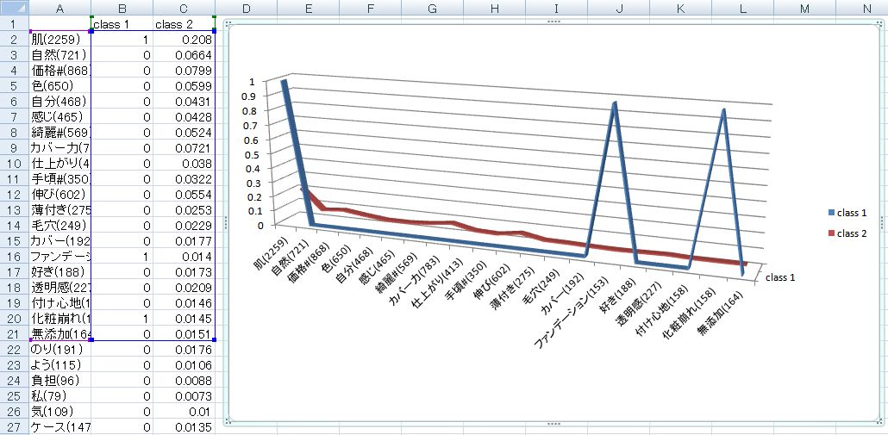
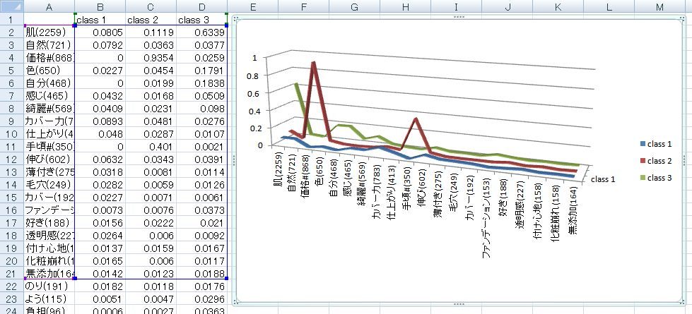
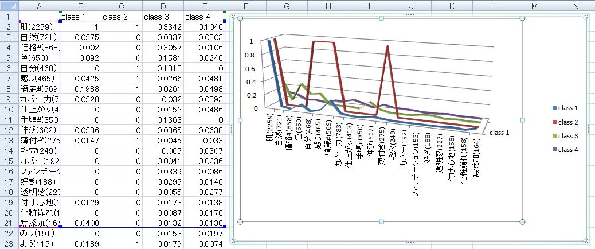
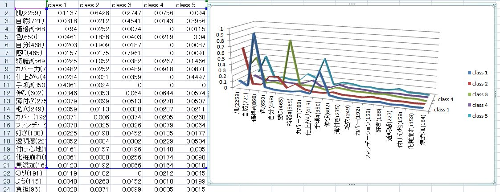

# poLCAに基づく分析手法
 * 作者: 島田さん、ノートブックでの実装: 舘野
## 資料
 * ~~使用するすべてのデータ、プログラム、処理結果を、[attachment:poLCA_set_0.2.zip ここ(v0.2)]からダウンロードできます。~~
 * 使用するすべてのデータ、プログラム、処理結果はこのリポジトリーにあります。
## 変更履歴
1. 2017年7月16日: 初版(v0.1)
1. 2017年7月17日: (v0.2)
1. 2017年9月21日: GitHubに引っ越し
  * M3.xlsxの各シート(class数別)に、Predicted class membershipsの行を足しました。
  * プログラムをプログラムファイルに入れて、ノートブックの記述を短くしました。

## 原文表
 * ここではサンプルデータとして、フリーアンサー10,859件中に重要度の高い100個の名詞が含まれているかどうかを示した原文表を用います。「現在使用しているファンデーションの気に入っているところは何ですか？」がフリーアンサーの問いです。

 

 * この原文表は、[PPMP](https://github.com/t-magic/SOFT/blob/master/PPMP/PPMP.md)で作成しました。

## 処理手順
 * Jupyterのノートブックを二つ用います。最初に、[実行例1](poLCA_Py.html)から始めます。途中で、[実行例2](poLCA_R.html)を使用します。その後、元のpoLCA_Py.ipynbにもどります。

## 処理結果
### <font color="Blue">最適な潜在クラス数の確認</font>
* M3.xlsx
 * AICで見ると、潜在クラス数が5個のときが最小値なので、5が最適な潜在クラス数である。
 * BICで見ると、潜在クラス数が3個のときが最小値なので、3が最適な潜在クラス数である。

  

----
#### <font color="Blue">クラス数 = 1</font>

  

----
#### <font color="Blue">クラス数 = 2</font>

  

----
#### <font color="Blue">クラス数 = 3</font>

  

----
#### <font color="Blue">クラス数 = 4</font>

  

----
#### <font color="Blue">クラス数 = 5</font>

  

## 参考
* [赤池情報量基準AICとベイズ情報量基準BIC - 数学 解決済 | 教えて!goo](https://oshiete.goo.ne.jp/qa/7913311.html)

  ```
  AIC=－2\{対数尤度\}＋2\{モデルパラメータ数\}
  BIC=－2\{対数尤度\}＋log(\{サンプルサイズ})\{モデルパラメータ数\}
  とあらわされます。
  第1項は，モデルの当てはまりを表すものですので，当てはまりが
  良いほど小さくなります。また，同じデータでは関係ありませんが，
  サンプルサイズが大きくなれば，小さくなります。

  第2項は，「罰則項」とも呼ばれ，パラメータ数が多いほど(すなわちモデルが
  複雑になるほど)大きくなります。
  あてはまりが良くても滅茶苦茶複雑なモデルは好ましくないということで，
  いずれの指標も，当てはまりが良く，なおかつシンプルなモデルが
  志向される指標といえるでしょう。
  ```
* [AICとMDLとBIC(赤池 弘次、日本オペレーションズ・リサーチ学会Vol.41_07_375.pdf)](http://www.orsj.or.jp/~archive/pdf/bul/Vol.41_07_375.pdf)
